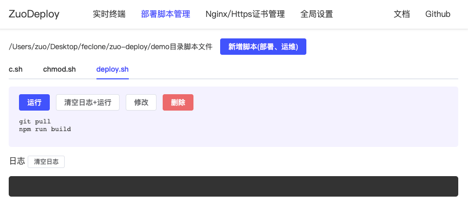
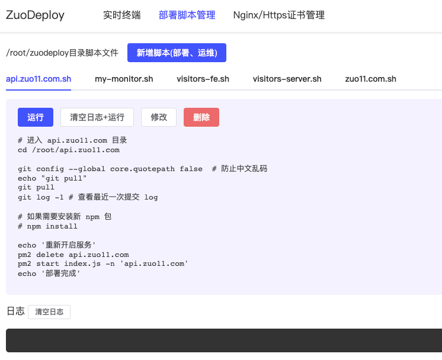
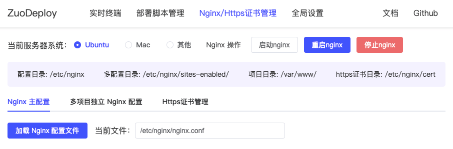
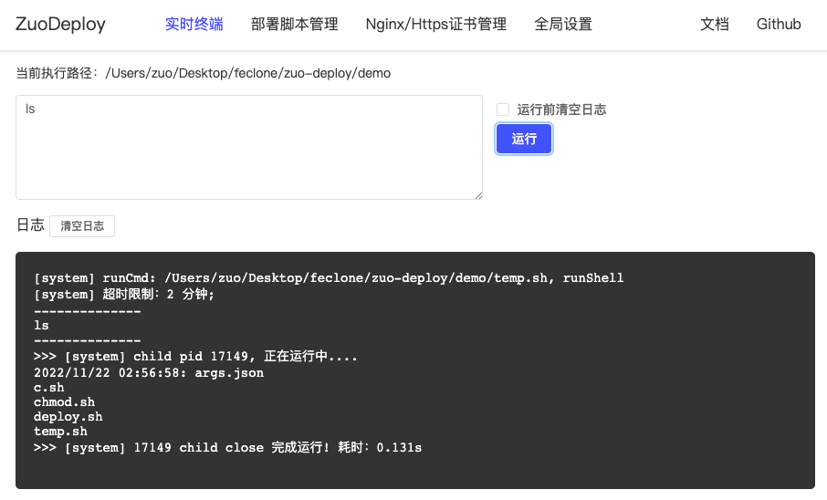

# zuo-deploy

基于 Vue3 + Node.js 的轻量 Linux 操作面板，支持简单实时终端、自动化部署、持续集成、Nginx 配置管理/操作、Https 证书管理等。

 

**注意：不支持 windows 系统，仅支持 Linux/MacOS 等**



## 使用

如果是一台全新的服务器，需要先安装 node、git、nginx，如果已安装，可以跳过这一步

```bash
# 以一台全新的 centos 为例，安装基础环境

# 1、安装 git
yum install git -y

# 2、使用 nvm 安装 node
git clone https://gitee.com/mirrors/nvm.git ~/.nvm && cd ~/.nvm && git checkout `git describe --abbrev=0 --tags`
echo ". ~/.nvm/nvm.sh" >> /etc/profile
source /etc/profile
nvm install v14.19.0
nvm install 16.19.0
nvm use 14.19.0
# 设置 npm 镜像为淘宝源
npm config set registry https://registry.npmmirror.com/

# 3、安装 nginx
yum install -y nginx
```

安装
```bash
# 全局安装
npm install zuo-deploy pm2 -g

# 新建一个目录，用于 zuo-deploy 运行目录，创建的部署脚本会存放到该目录
mkdir zuodeploy; cd zuodeploy;

# 开启服务
zuodeploy start
# ✔ 请指定部署服务监听端口： … 7777
# ✔ 请设置登录密码（默认：888888） … ******

# 访问 127.0.0.1:7777 打开操作界面，密码 888888
# 如果是服务器：服务器ip:7777
```

**注意: 如果使用的是云服务器, 请开放防火墙及配置安全组放行. 以下为示例**

**配置安全组**:


**防火墙放行**:


## 部署脚本管理

支持多项目并行部署，log 互不干扰。新建脚本注意文件名需要以 .sh 命名



### Vue前端项目部署脚本

以下为 visitors.zuo11.com 项目自动化部署脚本（vue3+ts+vite）

```bash
# 进入项目目录
cd /root/visitors

# 获取最近更新
git pull;
git log -1; # 查看最近一次提交 log

# 部署前端服务
cd visitors-fe;
# 如果需要安装新 npm 包
# npm install;
npm run build;
echo '前端服务部署完成'
```
### Node接口服务部署脚本

以下为 api.zuo11.com 接口服务自动化部署脚本

```bash
# 进入 api.zuo11.com 目录
cd /root/api.zuo11.com

git config --global core.quotepath false  # 防止中文乱码
echo "git pull"
git pull
git log -1 # 查看最近一次提交 log

# 如果需要安装新 npm 包
# npm install 

echo '重新开启服务'
pm2 delete api.zuo11.com
pm2 start index.js -n 'api.zuo11.com'
echo '部署完成'
```

### 通用部署脚本
```bash
echo "开始部署..."

# 进入项目目录
cd /var/www/hello-world

# 防止部署 log 中文乱码
git config --global core.quotepath false 

echo "git pull"
git pull 

# 查看最近一次提交 log，了解当前部署的是哪个版本
echo "git log -1"
git log -1 

# 构建相关
# npm install
# 构建
npm run build

echo "部署完成!"
```

### 其他任务类脚本

除了部署，也可以用于数据备份、跑一些脚本任务。

## Nginx/Https证书管理

支持 nginx 配置管理、多 nginx 配置管理、https 证书管理、nginx 服务重启等。



### Nginx 配置参考
```bash
# For more information on configuration, see:
#   * Official English Documentation: http://nginx.org/en/docs/
#   * Official Russian Documentation: http://nginx.org/ru/docs/

user root;
worker_processes auto;
error_log /var/log/nginx/error.log;
pid /run/nginx.pid;

# Load dynamic modules. See /usr/share/doc/nginx/README.dynamic.
include /usr/share/nginx/modules/*.conf;

events {
    worker_connections 1024;
}

http {
    log_format  main  '$remote_addr - $remote_user [$time_local] "$request" '
                      '$status $body_bytes_sent "$http_referer" '
                      '"$http_user_agent" "$http_x_forwarded_for"';

    access_log  /var/log/nginx/access.log  main;

    sendfile            on;
    tcp_nopush          on;
    tcp_nodelay         on;
    keepalive_timeout   65;
    types_hash_max_size 4096;

    include             /etc/nginx/mime.types;
    default_type        application/octet-stream;

    # Load modular configuration files from the /etc/nginx/conf.d directory.
    # See http://nginx.org/en/docs/ngx_core_module.html#include
    # for more information.
    include /etc/nginx/conf.d/*.conf;
    
    gzip on;
    gzip_vary on;
    gzip_min_length 1000;
    gzip_comp_level 2;
    gzip_types text/plain text/css text/xml text/javascript application/x-javascript application/xml image/jpeg image/gif image/png application/javascript;

    server {
        listen       80;
        listen       [::]:80;
        server_name  xx.com www.xx.com;
        charset utf-8;

        if ($host = 'xx.com') {
            rewrite ^/(.*)$ http://www.xx.com/$1 permanent;
        }
        
        #charset koi8-r;

        #access_log  logs/host.access.log  main;

        location / {
        #   root   C:\Users\Administrator\Desktop\dist;
           root  /root/xx.com/dist;
           index  index.html index.htm;
        }
        
        # 配置 404
        error_page  404 /root/zuo11.com/dist/404.html;

        # redirect server error pages to the static page /50x.html
        #
        error_page   500 502 503 504  /50x.html;
        location = /50x.html {
            root   html;
        }
    }
    
    server {
        listen   80;
        server_name  demo.xx.com;
        charset  utf-8;
        location / {
       	 	root  /root/demo.xx.com;
       	 	index  index.html index.htm;
   	 	}
    }
    
    server {
        listen   80;
        server_name  test.xx.com;
        charset  utf-8;
        location / {
            root   /root/test/test-fe/dist;     
            index index.html index.htm;
            try_files $uri $uri/ /index.html;
   	 	}
    }

    server {
        listen       443 ssl;
        server_name  api.zuo11.com;

        ssl_certificate     cert/3391782_api.xxx.com.pem;
        ssl_certificate_key cert/3391782_api.xx.com.key;

        ssl_session_cache    shared:SSL:1m;
        ssl_session_timeout  5m;

        # ssl_ciphers  HIGH:!aNULL:!MD5;
        # ssl_prefer_server_ciphers  on;

        ssl_ciphers ECDHE-RSA-AES128-GCM-SHA256:ECDHE:ECDH:AES:HIGH:!NULL:!aNULL:!MD5:!ADH:!RC4;  #使用此加密套件。
		ssl_protocols TLSv1 TLSv1.1 TLSv1.2;   #使用该协议进行配置。
		ssl_prefer_server_ciphers on;

        location / {
            # root   html;
            # index  index.html index.htm;
            proxy_pass http://127.0.0.1:7778;
        }
    }
}
```
## 实时终端

支持简单终端，但涉及 vi 等需要等待输入的操作，建议使用 ssh 直连。一般常用功能

- mkdir, cd, ls, pwd
- chmod 0777 xxx（修改目录权限）
- 其他 terminal 操作



## 全局设置
- 脚本执行超时时间，默认 2 分钟（推荐），可选 5, 10, 30。主要防止服务器 cpu 占用率过高，减少资源/内存占用。

## 其他
### 服务 log 查询

zuodeploy start 会用 pm2 开启一个 zuodeploy 服务，再次执行 zuodeploy start 会删除原服务，再次开启新服务。**如果开启失败，重新运行一次命令即可**

```bash
# 查看 log
pm2 log
pm2 log zuodeploy --lines 1000 # 指定行
```

### pm2 相关

如果直接使用 node xx.js 运行服务，进程很容易被杀掉，这里使用 pm2 以守护进程方式后台运行服务

```js
pm2 stop zuodeoploy
pm2 start src/index.js -n 'zuodeoploy'
```

跨文件传参, 文件读写

## 历史版本

Tag | 描述 | 实现文档
--- | --- | ---
[v0.3.2](https://github.com/zuoxiaobai/zuo-deploy/tree/v0.3.2) | 用 js 写一个 CI、CD 工具 |  [Vue + Node.js 从 0 到 1 实现自动化部署工具](http://www.zuo11.com/blog/2022/2/zuo_deploy_think.html)

## License

MIT
